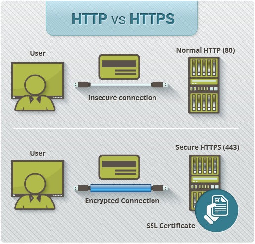

# HTTPS SSL

                        
 How Does HTTPS Work?
 
HTTPS pages typically use one of two secure protocols to encrypt communications - SSL (Secure Sockets Layer) or TLS (Transport Layer Security). Both the TLS and SSL protocols use what is known as an 'asymmetric' Public Key Infrastructure (PKI) system. An asymmetric system uses two 'keys' to encrypt communications, a 'public' key and a 'private' key. Anything encrypted with the public key can only be decrypted by the private key and vice-versa.

 As the names suggest, the 'private' key should be kept strictly protected and should only be accessible the owner of the private key. In the case of a website, the private key remains securely ensconced on the web server. Conversely, the public key is intended to be distributed to anybody and everybody that needs to be able to decrypt information that was encrypted with the private key.

What is a HTTPS certificate?
When you request a HTTPS connection to a webpage, the website will initially send its SSL certificate to your browser. This certificate contains the public key needed to begin the secure session. Based on this initial exchange, your browser and the website then initiate the 'SSL handshake'. The SSL handshake involves the generation of shared secrets to establish a uniquely secure connection between yourself and the website.

When a trusted SSL Digital Certificate is used during a HTTPS connection, users will see a padlock icon in the browser address bar. When an Extended Validation Certificate is installed on a web site, the address bar will turn green.

HTTPS Browsers
Why Is an SSL Certificate Required?
All communications sent over regular HTTP connections are in 'plain text' and can be read by any hacker that manages to break into the connection between your browser and the website. This presents a clear danger if the 'communication' is on an order form and includes your credit card details or social security number. With a HTTPS connection, all communications are securely encrypted. This means that even if somebody managed to break into the connection, they would not be able decrypt any of the data which passes between you and the website.

Benefits of Hypertext Transfer Protocol Secure
The major benefits of a HTTPS certificate are:

Customer information, like credit card numbers, is encrypted and cannot be intercepted
Visitors can verify you are a registered business and that you own the domain
Customers are more likely to trust and complete purchases from sites that use HTTPS
HTTP and HTTPS: What do they do, and how are they different?
You click to check out at an online merchant. Suddenly your browser address bar says HTTPS instead of HTTP. What's going on? Is your credit card information safe?

Good news. Your information is safe. The website you are working with has made sure that no one can steal your information.

Instead of HyperText Transfer Protocol (HTTP), this website uses HyperText Transfer Protocol Secure (HTTPS).

Using HTTPS, the computers agree on a "code" between them, and then they scramble the messages using that "code" so that no one in between can read them. This keeps your information safe from hackers.

They use the "code" on a Secure Sockets Layer (SSL), sometimes called Transport Layer Security (TLS) to send the information back and forth.

How does HTTP work? How is HTTPS different from HTTP? This tutorial will teach you about SSL, HTTP and HTTPS.

How Does HTTP Work?
In the beginning, network administrators had to figure out how to share the information they put out on the Internet.

They agreed on a procedure for exchanging information and called it HyperText Transfer Protocol (HTTP).

Once everyone knew how to exchange information, intercepting on the Internet was not difficult. So knowledgeable administrators agreed upon a procedure to protect the information they exchanged. The protection relies on SSL Certificate to encrypt the online data. Encryption means that the sender and recipient agree upon a "code" and translate their documents into random-looking character strings.

The procedure for encrypting information and then exchanging it is called HyperText Transfer Protocol Secure (HTTPS).

With HTTPS if anyone in between the sender and the recipient could open the message, they still could not understand it. Only the sender and the recipient, who know the "code," can decipher the message.

Humans could encode their own documents, but computers do it faster and more efficiently. To do this, the computer at each end uses a document called an "SSL Certificate" containing character strings that are the keys to their secret "codes."

SSL certificates contain the computer owner's "public key."

The owner shares the public key with anyone who needs it. Other users need the public key to encrypt messages to the owner. The owner sends those users the SSL certificate, which contains the public key. The owner does not share the private key with anyone.

The security during the transfer is called the Secure Sockets Layer (SSL) and Transport Layer Security (TLS).

The procedure for exchanging public keys using SSL Certificate to enable HTTPS, SSL and TLS is called Public Key Infrastructure (PKI).